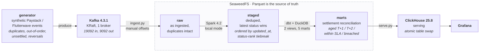

# NaijaPay Lakehouse

A settlement reconciliation pipeline for Nigerian card and bank-transfer
payments, sized to run on one laptop.

[](https://github.com/laurence702/naijapay-lakehouse/actions/workflows/tests.yml)
[](LICENSE)

Synthetic Paystack and Flutterwave-shaped events go into Kafka. Deduped,
modelled and reconciled data comes out in ClickHouse. It answers one question
end to end:

> **Which successful charges have not been settled, how overdue are they, and
> how much money is that?**

That question is the whole design. Every component below exists because
answering it correctly needs something that component does.



Airflow 3.3.1 orchestrates all of it: one DAG, seven tasks, LocalExecutor.

## Run it

Needs Colima or Docker Desktop with 6 GB, and Docker Compose 2.20 or newer for
the `include:` directive.

```bash
git clone https://github.com/laurence702/naijapay-lakehouse
git clone https://github.com/laurence702/data-engineering-shared-infra   # sibling dir

cd naijapay-lakehouse
make bootstrap    # resolves absolute paths into .env
make preflight    # docker, memory, ports, image pins, env sanity
make build        # airflow image: pyspark + JRE + isolated dbt venv
make demo         # start everything, run the DAG, print the reconciliation
```

`make preflight` is not optional politeness. It checks the things that actually
break this stack, and it fails in two seconds instead of eight minutes into an
image pull. Run it first.

The platform services (Kafka, SeaweedFS, ClickHouse, Postgres, Redis) live in a
sibling repo and get pulled in through Compose's `include:` rather than
copy-pasted, so every service is defined exactly once. Point `INFRA` elsewhere
if your layout differs: `make up INFRA=/path/to/shared-infra`.

`make demo` finishes by printing reconciliation buckets straight out of
ClickHouse. `make urls` prints where to point a browser.

## What is actually hard here

A payments dataset that is clean is a payments dataset that is fake.

The generator manufactures four problems on purpose, at rates set as constants
in `src/naijapay/generate.py`. Each stage of the pipeline exists to handle one
of them:

| Problem | Rate | Handled by |
|---|---|---|
| At-least-once delivery, duplicate `event_id` | `DUPLICATE_RATE = 0.02` | Spark `dropDuplicates` |
| Two or more events per charge, `pending` then a terminal status | every charge | Spark window function, latest wins |
| Terminal event arrives before its own `pending` | `OUT_OF_ORDER_RATE = 0.05` | Order by `updated_at`, not arrival, with a deterministic status-rank tiebreak |
| Successful charge that never settles | `UNSETTLED_RATE = 0.031` | `mart_settlement_reconciliation`, aged into T+1 / T+2 / within-SLA / breached |

Plus reversals at `REVERSAL_RATE = 0.012`, because a charge that succeeded and
was later charged back is not the same thing as a charge that failed, and a
reconciliation report that conflates them is wrong in a way nobody notices.

Two properties matter more than any of that, because they are the difference
between a pipeline and a script that ran once:

**Reruns are deterministic.** Two runs over the same input produce
byte-identical marts. This needs the status-rank tiebreak: two events for one
charge can share an `updated_at`, and without a tiebreak the winner is whichever
row Spark happened to see first. There is a test for exactly that case.

**"Today" comes from the data, not the clock.** The reconciliation mart derives
its as-of date from `max(ingested_at)`, not `current_date`. A mart whose output
changes because you reran it on a Tuesday cannot be tested, and cannot be diffed
against yesterday to see what actually moved.

## Money

Every amount is an integer count of kobo, everywhere, end to end. Fees are
integer arithmetic. Naira conversion happens once, at the presentation edge, and
never inside an aggregate.

USD charges convert at a stored FX rate (`NGN_PER_USD`, static on purpose: a
real pipeline joins an FX table) and truncate to integer kobo. That produces a
small, genuine rounding drift.

The drift is not hidden. It is surfaced as `settlement_variance_kobo` in the
reconciliation mart, and `src/naijapay/quality.py` warns on drift consistent
with rounding while failing on drift large enough to be a pricing error. To see
the actual figure for your run:

```sql
SELECT sum(settlement_variance_kobo), count()
FROM naijapay.mart_settlement_reconciliation;
```

Truncation rather than rounding is deliberate. Rounding half-up on every row
biases the total upward; truncation biases it in one direction you can predict,
measure and assert on.

## Stack

| Component | Version | Job | Why not something else |
|---|---|---|---|
| Kafka (KRaft) | 4.3.1 | Event transport | Zookeeper is gone in 4.x. Two listeners: `kafka:19092` inside, `localhost:9092` outside. Getting that wrong is the most common reason a local Kafka works from Docker and hangs from the host |
| SeaweedFS | 4.46 | Object store: raw / staged / marts | The lakehouse. Parquet here is the source of truth. Was MinIO until [ADR 0005](docs/adr/0005-object-store-minio-is-a-dead-end.md) |
| PySpark (local mode) | 4.2.0 | Dedupe, latest-status-wins | Unnecessary at this volume, and [ADR 0002](docs/adr/0002-spark-local-mode.md) says so out loud before explaining why it is here anyway |
| dbt + DuckDB | 1.12.4 / 1.5.5 | Staging to marts | Excellent transform engine, poor serving database |
| ClickHouse | 25.8.9 | Serving | Real concurrency for dashboards. [ADR 0001](docs/adr/0001-duckdb-transforms-clickhouse-serving.md) |
| Airflow | 3.3.1 | Orchestration, 7 tasks | LocalExecutor forks tasks inside the scheduler, which is why the scheduler gets 1.8 GB and nothing else does |
| Postgres | 16.10 | Airflow metadata | Shared instead of a second instance, which saves ~380 MB |

Every image tag lives in the platform repo's `.env` and nowhere else.
`make preflight` verifies each one resolves against the registry without
pulling it.

## The 6 GB budget

The VM has 6 GB, so the full stack cannot run at once. That is a design
constraint rather than an inconvenience, and it drove most of
[ADR 0003](docs/adr/0003-profiles-and-the-6gb-budget.md).

```
core (postgres + seaweedfs + redis)  0.76 GB
kafka                                0.77 GB
clickhouse                           1.00 GB
airflow api + scheduler + dagproc    2.71 GB
-------------------------------------------
                                     5.24 GB    ~0.76 GB left for dockerd
```

Every service sits behind a Compose profile and declares a `mem_limit`. The
limits were sized backwards from one binding constraint: the local-mode Spark
driver runs as a subprocess of the Airflow scheduler, so it has to fit under the
scheduler's ceiling. Raise one number and you lower another.

There is no `make up-all` target, deliberately. Prometheus and Grafana do not
fit alongside Kafka, ClickHouse and Airflow, so you stop Kafka after ingest and
start them in the gap:

```bash
docker compose stop kafka
make -C ../data-engineering-shared-infra up-observe
```

`make mem` prints live usage against the budget.

## Tests

35 tests. None of them need Docker, Kafka, an object store or ClickHouse, which
is why they run in CI on every push.

```bash
make venv
make test-fast     # 24 tests, pure logic, under a second
make test-spark    # 6 tests, real PySpark, starts a JVM
make test-dbt      # 5 tests: builds 2 staging views + 5 marts, runs every dbt test
make test          # all of it
make lint          # ruff check + format
```

The dbt tests consume the output of the **real** Spark transform, not a
reimplementation of it. A hand-rolled stand-in drifts from the production job
and quietly stops testing anything.

On top of the pytest suite, dbt runs 5 singular data tests
(`dbt/naijapay/tests/`) plus generic tests declared in the `schema.yml` files:
no negative money anywhere, no settlement dated before its own transaction, no
settled row carrying an outstanding balance, success rate inside a plausible
band, every USD charge carrying an FX rate. `make test-dbt` prints the total.

## Layout

```
dags/                     one DAG, 7 tasks
src/naijapay/
  config.py               all env reading, fails once at import
  schemas.py              explicit Arrow schemas, no inference anywhere
  generate.py             synthetic events, stdlib only, seeded
  ingest.py               Kafka drain to raw Parquet, manual offset commit
  transform_spark.py      raw to staged, local-mode Spark
  serve.py                marts to ClickHouse behind an atomic table swap
  quality.py              checks the serving layer, not the files
dbt/naijapay/             2 staging views, 5 marts, 5 singular tests
docs/adr/                 why things are the way they are
scripts/                  preflight, env guard, demo, urls
```

## Design decisions

Read these before changing anything. They are short and they explain the
non-obvious choices.

- [0001](docs/adr/0001-duckdb-transforms-clickhouse-serving.md) DuckDB transforms, ClickHouse serving
- [0002](docs/adr/0002-spark-local-mode.md) Spark in local mode, and why it is here at all
- [0003](docs/adr/0003-profiles-and-the-6gb-budget.md) Compose profiles and the 6 GB budget
- [0004](docs/adr/0004-kraft-and-pinned-images.md) KRaft, and one place for every version pin
- [0005](docs/adr/0005-object-store-minio-is-a-dead-end.md) SeaweedFS replaces MinIO

0005 is the interesting one. A pinned MinIO image turned out never to have been
published, which surfaced that MinIO had stopped shipping free container images
entirely. Swapping the object store touched 19 files, and almost all of that was
renaming `MINIO_*` to `S3_*`. Naming the variables after the vendor is what
turned a protocol-level swap into a 19-file change. The next swap is one line.

## Known gaps

Stated rather than hidden, because a portfolio repo that claims to be production
infrastructure is lying and everybody can tell.

- **Kafka is not scraped by Prometheus.** The image exposes JMX, not Prometheus,
  so it needs a `jmx_exporter` sidecar at roughly 150 MB. On this budget that
  lost to giving ClickHouse headroom. Known gap, not an oversight.
- **Spark reads local files, not `s3a://`.** Wiring `hadoop-aws` into a local
  job is jar version-matching for no change in logic. [ADR 0002](docs/adr/0002-spark-local-mode.md).
- **No incremental models.** Everything is a full refresh. Correct at this
  volume, and the first thing to change if the data grew.
- **No CDC and no schema registry.** Producer and consumer agree on a schema by
  convention in `schemas.py`. A real deployment uses Avro or Protobuf with a
  registry.
- **Single Kafka broker, replication factor 1.** No durability story at all.
  Fine on a laptop, unacceptable anywhere else.
- **The FX rate is a constant.** A real pipeline joins a rates table with
  validity windows, and the reconciliation would then need to know which rate
  applied when.

## Licence

MIT. See [LICENSE](LICENSE).
