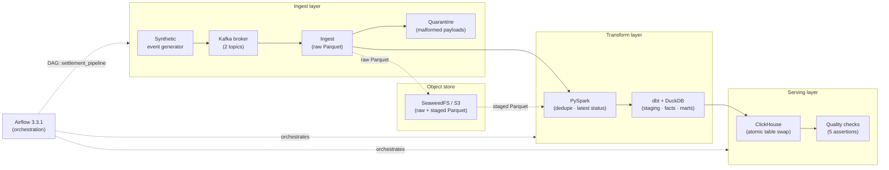

# Payment Settlement Lakehouse

[](https://github.com/laurence702/payment-settlement-lakehouse/actions/workflows/tests.yml)
[](LICENSE)

Payment Settlement Lakehouse is a local, production-shaped data pipeline for
reconciling **synthetic Paystack/Flutterwave-shaped events**. It models how a
data platform can identify settlement gaps and amount discrepancies while
preserving raw evidence, deterministic transforms, and clear data-quality
states.

It is not a payment processor. It has no official Paystack or Flutterwave
integration, real customer data, banking access, or production deployment. No
real money is moved.

## The question it answers

> For eligible successful synthetic charges, which have no verified settlement
> line, what net amount is expected or outstanding, and is the settlement
> source current enough to make that conclusion?

The result is a synthetic reconciliation signal. It does not prove that money
reached a merchant bank account.

## Architecture


```mermaid
flowchart LR
    subgraph Ingest["Ingest layer"]
        G["Synthetic\nevent generator"] --> K["Kafka broker\n(2 topics)"] --> I["Ingest\n(raw Parquet)"]
        I --> Q["Quarantine\n(malformed payloads)"]
    end

    subgraph Transform["Transform layer"]
        I --> SP["PySpark\n(dedupe · latest status)"]
        SP --> DBT["dbt + DuckDB\n(staging · facts · marts)"]
    end

    subgraph Serve["Serving layer"]
        DBT --> CH["ClickHouse\n(atomic table swap)"]
        CH --> QC["Quality checks\n(5 assertions)"]
    end

    subgraph Store["Object store"]
        S3["SeaweedFS / S3\n(raw + staged Parquet)"]
    end

    I -. raw Parquet .-> S3
    S3 -. staged Parquet .-> SP

    A["Airflow 3.3.1\n(orchestration)"] -. DAG: settlement_pipeline .-> Ingest
    A -. orchestrates .-> Transform
    A -. orchestrates .-> Serve
```

The local stack is Kafka, SeaweedFS-compatible object storage (S3-API), PySpark,
dbt with DuckDB, ClickHouse, and Airflow. It is designed for a 6 GB Docker VM
(Colima on Apple Silicon); see [ADR 0003](docs/adr/0003-profiles-and-the-6gb-budget.md).

## Benchmarks

Numbers from the last successful end-to-end run on an M1 MacBook inside a 6 GB
Colima VM (`manual__2026-09-28T07:18:08` · 100,000 synthetic events):

| Metric | Value |
|---|---|
| End-to-end DAG runtime | **75 seconds** |
| Total transaction value | **₦1.6 billion** |
| Outstanding synthetic exposure | **₦51.3 million** |
| `fct_transactions` | 100,000 rows · 7.84 MiB |
| `fct_settlements` | 85,180 rows · 5.38 MiB |
| `mart_settlement_reconciliation` | 87,910 rows · 6.27 MiB |
| Match rate | 93.4% `matched` |
| Missing settlement | 2,731 transactions |
| Amount-mismatched rows | 3,054 rows |
| Merchants / Customers / Days | 40 / 95,085 / 14 |
| Automated tests | **49** (unit + Spark + dbt) |

## Data and reconciliation flow

The seeded generator emits duplicates, out-of-order status events, missing
settlements, reversals, amount discrepancies, merchant T+1/T+2 rules, and
shared payout batches. Money remains integer kobo end to end.

1. Kafka carries transaction and settlement events keyed by `transaction_ref`.
2. Ingest writes append-only raw Parquet and commits Kafka offsets only after
   durable writes. Malformed payloads are retained separately with bounded raw
   payload, source topic, time, and safe error metadata.
3. Spark removes duplicate event IDs and selects the latest transaction status
   with a deterministic status-rank tie-break.
4. dbt derives transaction facts, settlement-line facts, expected settlement
   dates, and the reconciliation mart.
5. ClickHouse serves the parquet marts after an atomic table swap.

`mart_settlement_reconciliation` retains v0.1-compatible `is_settled` and
`reconciliation_bucket` fields. New consumers should use these fields:

| Field | Meaning |
|---|---|
| `expected_net_kobo` | Charge net expected in NGN kobo. |
| `settled_net_kobo` | Settlement-line net amount, if present. |
| `settlement_variance_kobo` | Settled minus expected net amount. |
| `outstanding_net_kobo` | Expected amount still unpaid; zero for matched, overpaid, and reversal-after-settlement cases. |
| `expected_settlement_date` | Success date plus the merchant's synthetic T+1 or T+2 rule. |
| `source_freshness_status` | `fresh` or `stale_or_incomplete`, based on synthetic settlement-report watermark coverage. |

`reconciliation_status` is one of `matched`, `missing_settlement`,
`partial_settlement`, `short_paid`, `overpaid`, `reversed_after_settlement`, or
`unverified_source`. `unverified_source` prevents a stale or incomplete
synthetic settlement feed from being represented as a missing-settlement
breach. A `payout_id` connects multiple settlement lines to a synthetic payout
batch while preserving `transaction_ref` compatibility.

## Run locally

Use Docker Desktop or Colima configured with 6 GB and Docker Compose v2.

```bash
git clone https://github.com/laurence702/payment-settlement-lakehouse
cd payment-settlement-lakehouse

make bootstrap
make preflight
make build
make demo
```

`make bootstrap` creates the local `.env` and generated development secrets.
`make preflight` verifies Docker, memory, disk, ports, pins, and environment
configuration. `make demo` starts the required services, triggers the Airflow
DAG, and reports the reconciliation result.

## Test commands

```bash
make venv
make lint
make test-fast
make test-spark
make test-dbt
make test
make verify
```

`make test` runs unit, Spark, and dbt tests without the Docker stack.
`make verify` is the full Docker end-to-end verification; it requires enough
local Docker capacity and validates the DAG, container health, and non-empty
reconciliation output.

## Data-quality guarantees

- Explicit Arrow schemas are used rather than inferred JSON schemas.
- Raw data is append-only and retains duplicates and out-of-order records.
- Kafka offsets are manually committed only after raw Parquet writes complete.
- Malformed messages are quarantined instead of silently dropped.
- Transaction collapse is deterministic for equal timestamps.
- Monetary values are integer kobo, including expected, settled, variance, and
  outstanding amounts.
- dbt tests enforce key uniqueness, required fields, allowed reconciliation and
  freshness states, and basic source relationships.
- Pytest covers generator pathologies, quarantine records, real Spark staging,
  and dbt models built from staged Parquet (49 tests across 7 modules).

## Known limitations

- The source watermark is deterministic synthetic metadata, not a provider
  report API or a completeness guarantee from a real PSP.
- Settlement lines are synthetic charge-to-line mappings. Payout batches are
  represented, but bank credits, payout adjustments, reserves, and fees beyond
  the modeled line are not reconciled.
- Merchant rules are synthetic calendar-day T+1/T+2 rules. Business-day
  calendars, provider cutoffs, holidays, channel-specific rules, and timezone
  policy are future work.
- A matching synthetic settlement line does not prove merchant bank receipt.
- There are no signed webhooks, provider API/report ingestion, schema registry,
  replicas, production monitoring, CDC, or incremental dbt models.
- Kafka uses one broker and replication factor one. Spark runs locally and
  stages object-store inputs through local files to stay within the memory
  envelope.

## v0.2 and roadmap

Implemented in v0.2:

- Amount-aware reconciliation with a 7-state `reconciliation_status` and
  integer-kobo variance and outstanding-balance fields.
- Merchant-specific expected settlement dates anchored to the original success
  event, with per-merchant T+1/T+2 SLA classification.
- Synthetic source freshness and completeness signaling: `unverified_source`
  prevents a stale settlement feed from being counted as a breach.
- Payout-batch identifiers on settlement lines, preserving `transaction_ref`
  grain in `fct_settlements`.
- Append-only malformed-message quarantine with bounded raw payload retention.
- Quality-check grain fix: assertion #4 now mirrors the mart grain, including
  `reversed_after_settlement` rows present in `fct_settlements`.

Benchmark (100k events, 6 GB VM, M1 MacBook):
75-second end-to-end run · ₦1.6B total value · ₦51.3M synthetic outstanding
exposure surfaced · 93.4% match rate · 49 automated tests.

Later real-world requirements include signed provider webhooks and report/API
ingestion, trusted completeness contracts and cutoffs, payout adjustments and
bank-credit reconciliation, business calendars and auditable FX, schema
registry and replicas, plus production monitoring and deployment controls.

## Repository layout

```text
dags/                     Airflow orchestration
src/settlement/             generator, schemas, ingest, Spark, serving, checks
dbt/settlement/             staging models, facts, marts, and data tests
docs/adr/                 architecture decisions
scripts/                  bootstrap, preflight, demo, and verification helpers
```

## Licence

MIT. See [LICENSE](LICENSE).
